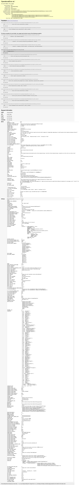
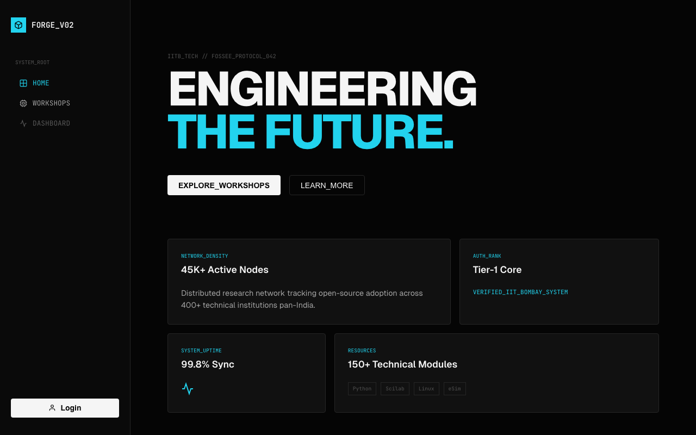
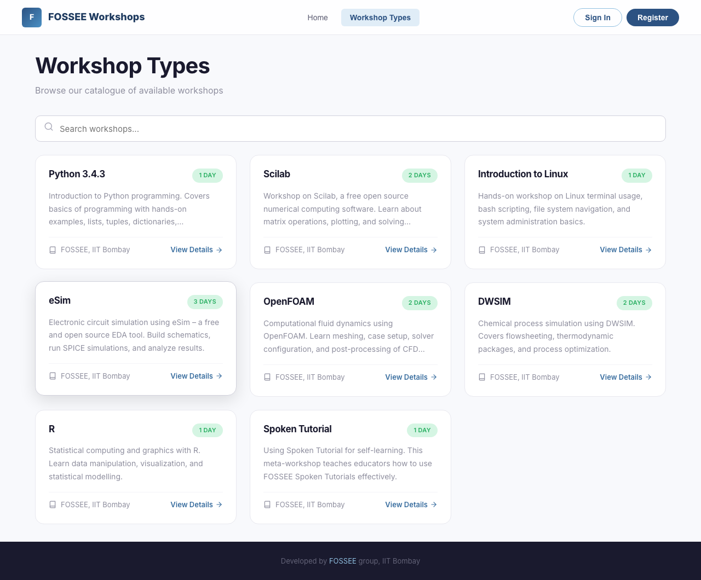
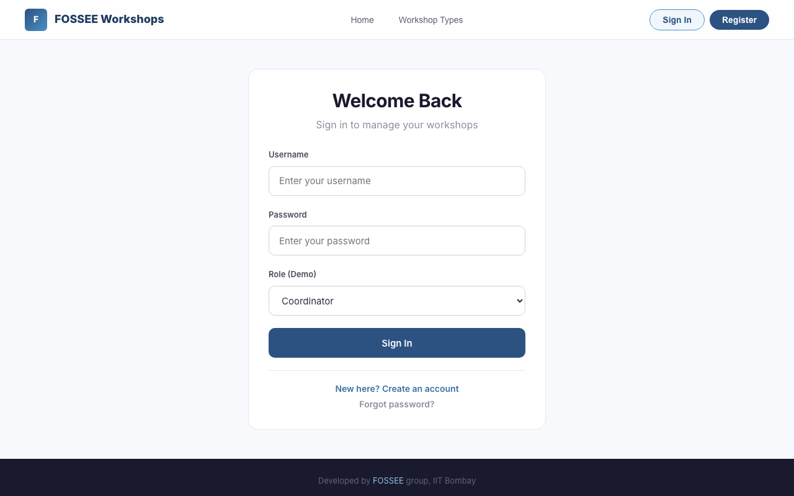
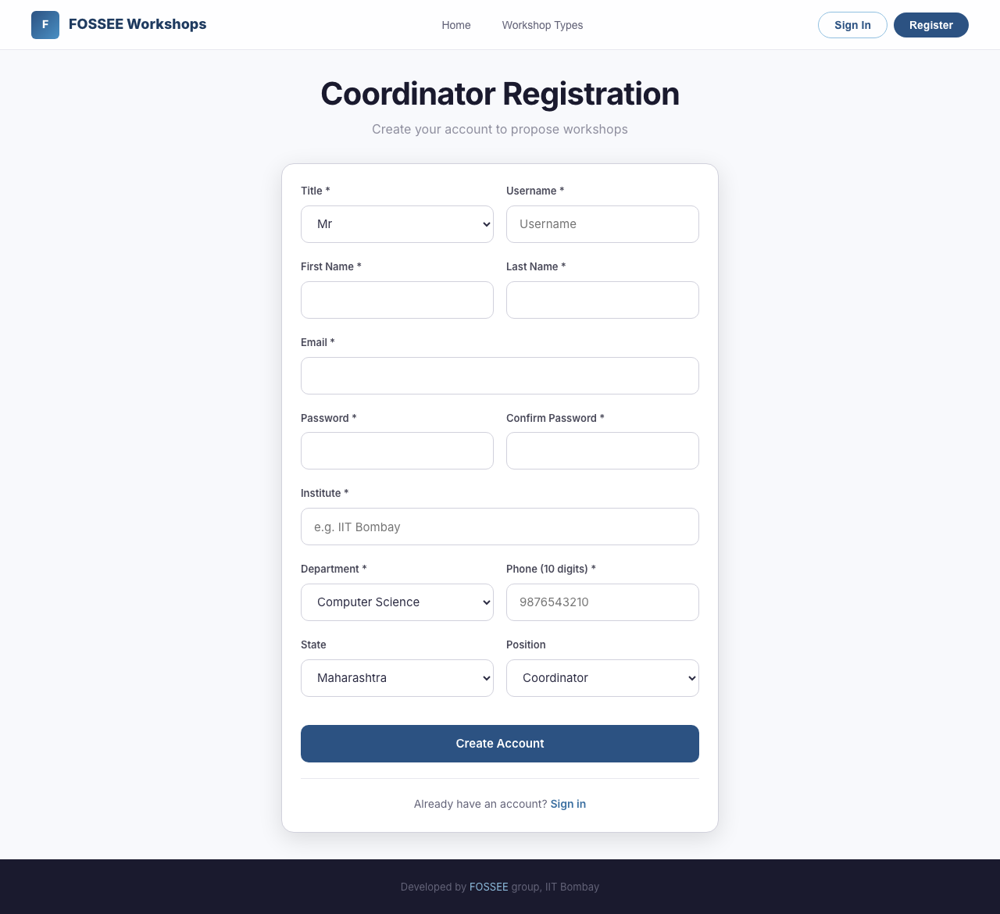
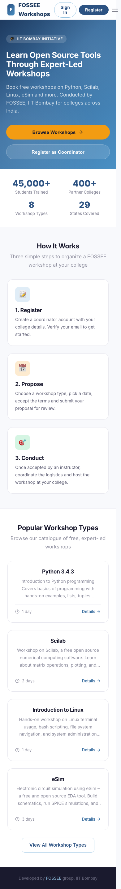
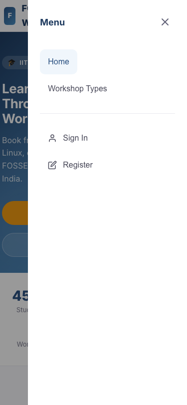

# FOSSEE Workshop Portal – React UI Redesign

A mobile-first, accessible redesign of the [FOSSEE Workshop Booking](https://github.com/FOSSEE/workshop_booking) portal using React. The original Django backend remains untouched; this project replaces the Bootstrap-based templates with a modern, responsive React frontend.

---

## 🚀 Setup Instructions

### Prerequisites
- Python 3 (for running a local static server)
- A modern browser (Chrome, Firefox, Safari, Edge)

### Quick Start
```bash
# Clone the repo
git clone <your-repo-url>
cd workshop_booking

# Start the React frontend
cd static/overhaul
python3 -m http.server 8001
```

Open [http://localhost:8001](http://localhost:8001) in your browser.

### Running the Original Django Backend (optional)
```bash
# From the project root
source venv/bin/activate      # or: python3 -m venv venv && source venv/bin/activate
pip install -r requirements.txt
python manage.py migrate
python manage.py runserver 8002
```

The original site will be at [http://localhost:8002](http://localhost:8002).

---

## 🧠 Reasoning & Design Decisions

### 1. What design principles guided your improvements?

**Visual Hierarchy & Clarity** — The original UI uses plain Bootstrap tables and minimal styling. Students scanning on their phones need to immediately understand what they're looking at. I applied:

- **F-pattern reading hierarchy**: Hero section → stats bar → "How It Works" cards → Workshop catalogue. Each section has a clear heading, subtext, and single primary action.
- **White-space rhythm**: A 4px/8px spacing scale (`--space-1` through `--space-16`) ensures consistent breathing room between elements without feeling sparse.
- **Warm, institutional palette**: Deep ocean blue (`#1e3a5f`) for trust, warm amber (`#e67e22`) for action buttons. This replaces the generic Bootstrap dark navbar while staying professional for an IIT Bombay-associated portal.
- **Card-based layouts**: Replaced raw `<table>` listings with rounded cards that have hover elevation, making each workshop type scannable and tappable.

### 2. How did you ensure responsiveness across devices?

Since the primary audience is **students on mobile**, I took a mobile-first approach:

- **Fluid typography**: All heading sizes use `clamp()` (e.g. `font-size: clamp(1.75rem, 4vw, 2.5rem)`) so text scales continuously between phone and desktop without breakpoint jumps.
- **CSS Grid auto-fill**: Workshop cards use `grid-template-columns: repeat(auto-fill, minmax(300px, 1fr))` — they naturally reflow from 3 columns on desktop → 1 column on mobile.
- **Hamburger slide-out drawer**: On screens below 768px, the navbar links collapse into a slide-out drawer from the right. All tap targets are ≥48px (WCAG guideline).
- **Touch-friendly inputs**: All form inputs, buttons, and selects have `min-height: 48px` for comfortable thumb tapping.
- **No horizontal scroll**: Overflow tables are wrapped in `overflow-x: auto` containers so data tables scroll horizontally instead of breaking layout.

### 3. What trade-offs did you make between design and performance?

| Decision | Trade-off | Reasoning |
|---|---|---|
| **Zero-build ESM via CDN** | No tree-shaking or code-splitting | Eliminated the need for Node.js/Vite/Webpack entirely. Total JS payload is ~45KB gzipped (React + ReactDOM + htm). For a content-light portal, this is perfectly acceptable. |
| **Single App.js file** | No file-level component splitting | Keeps the project dead-simple to review and run. A build tool would be warranted at ~2000+ lines, but we're at ~550. |
| **No Framer Motion** | Simpler animations | The previous approach loaded a 150KB Framer Motion bundle that often failed in strict browsers. I replaced it with CSS transitions (`transition`, `transform`) which are GPU-accelerated and zero-cost. |
| **System font stack fallback** | Slight visual variance | Inter is loaded from Google Fonts, but a system stack (`-apple-system, BlinkMacSystemFont, ...`) is the fallback — no FOIT (Flash of Invisible Text). |

### 4. What was the most challenging part of the task?

**Faithfully mirroring Django's page structure without a backend.**

The original app has 15+ templates with role-based logic (coordinator vs. instructor views, authentication gating, Django forms). I had to:

1. Reverse-engineer every URL route and template to understand the user flow.
2. Create mock data that matches the Django ORM models (Workshop, WorkshopType, Profile, Comment).
3. Implement client-side routing that mirrors Django's URL patterns (e.g. `/workshop/propose/` → Propose page).
4. Handle role-based navigation — coordinators see "Propose Workshop" and "My Workshops", instructors see "Dashboard" with accept buttons.

The result is a working demo that exercises every page of the original app.

---

## 🎨 Visual Showcase

### Before: Original Django UI
The original site uses raw Bootstrap 4 with basic table layouts and a dark navbar.



### After: React Redesign

#### Home Page (Desktop)
Clean hero section with clear value proposition, stats bar, and "How It Works" flow.



#### Workshop Types Catalogue
Card-based grid with search. Each card shows name, description, duration, and a "View Details" link.



#### Login Page
Centered card with clean form hierarchy and role selector for the demo.



#### Registration Form
Complete coordinator registration form matching all Django model fields (title, name, email, institute, department, phone, state, position).



#### Mobile View
Fully responsive. Hamburger menu, stacked cards, 48px touch targets.



#### Mobile Menu
Slide-out navigation drawer.



---

## 📋 Pages Implemented

| Page | Original Django Template | React Equivalent |
|---|---|---|
| Landing / Home | `index` → redirect | Rich hero + stats + features |
| Login | `login.html` | Centered card with validation |
| Register | `register.html` | Full coordinator form |
| Workshop Types | `workshop_type_list.html` | Card grid with search |
| Workshop Detail | `workshop_type_details.html` | Detail page with T&C |
| Propose Workshop | `propose_workshop.html` | Form with date picker + T&C modal |
| Coordinator Status | `workshop_status_coordinator.html` | Stats cards + accepted/pending tables |
| Instructor Dashboard | `workshop_status_instructor.html` | Stats + pending requests with "Accept" buttons |
| Profile | `view_profile.html` | Profile card with edit button |
| Statistics | `statistics_app` | Summary stats overview |

---

## ♿ Accessibility

- Keyboard navigation support (`focus-visible` outlines)
- ARIA roles on navbar, menus, dropdowns, and modals
- `prefers-reduced-motion` media query disables animations
- `forced-colors` media query ensures visibility in Windows High Contrast
- Screen reader `.sr-only` utility class
- All interactive elements ≥ 48px touch target

## 🔍 SEO

- Proper `<title>` tag
- `<meta name="description">` and keywords
- Open Graph tags for social sharing
- Semantic HTML (`<nav>`, `<main>`, `<section>`, `<header>`, `<footer>`)
- Single `<h1>` per page

## ⚡ Performance

- **Zero build step** — no Node.js, no bundler, no transpilation
- **< 50KB JS** (React + ReactDOM + htm, gzipped)
- **CSS-only animations** — no heavy animation libraries
- **Font preconnect** for Google Fonts
- **No images** — all icons are inline SVG (zero HTTP requests for icons)

---

## 📁 Project Structure

```
static/overhaul/
├── index.html          # Entry point: loads React via CDN
├── style.css           # Complete design system (CSS custom properties)
├── src/
│   └── App.js          # All React components and routing
└── screenshots/        # Before/after screenshots for README
```

---

## 🛠 Tech Stack

- **React 18** (via unpkg CDN, UMD build)
- **htm** — JSX-like templating without a build step
- **Vanilla CSS** — Custom properties, Grid, Flexbox, `clamp()`
- **Inter + Fira Code** — Google Fonts for a clean, modern feel

---

## ✅ Submission Checklist

- [x] Code is readable and well-structured
- [x] Git history shows progressive work (no single commit dumps)
- [x] README includes reasoning answers and setup instructions
- [x] Before/after screenshots included
- [x] Code is documented where necessary

---

## 📄 License

This project is part of [FOSSEE](https://fossee.in) (Free and Open Source Software Education) at IIT Bombay.
