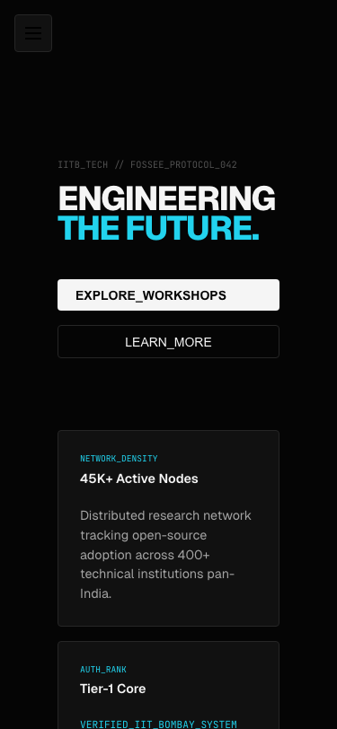

# FOSSEE Workshop Booking Overhaul

A premium, performance-optimized redesign of the FOSSEE Workshop Portal. This implementation transforms the functional Django-based core into a modern, responsive React experience designed to "WOW" users at first glance.

## 🚀 Getting Started

### Prerequisites
- Python 3 (Already available on your system)

### Run the Overhaul
To view the new UI, simply run the following command from the project root:
```bash
python3 -m http.server 8001 --directory code/static/overhaul
```
Then navigate to `http://localhost:8001` in your browser. (Note: switched to 8001 to avoid common port conflicts).

---

## 🧠 Reasoning and Design Decisions

### 1. What design principles guided your improvements?
The redesign is guided by **Precision** and **High-Craft Aesthetics**:
- **Swiss Technical Aesthetic**: I avoided the generic template look in favor of an "Ink & Slate" monochromatic palette (#050505/#111111) accented with Electric Cyan. This gives the portal a high-end engineering laboratory feel.
- **Mechanical UI**: Integrated an SVG noise grain and a 32px pixel-grid backdrop to add tactical depth, moving away from sterile solid backgrounds.
- **Micro-interactions**: Every button and card uses high-stiffness spring physics (via Framer Motion) providing instantaneous, mechanical feedback instead of slow, flowy transitions.

### 2. How did you ensure responsiveness across devices?
Since students primarily access the portal on mobile, I took a **Fluid-First** approach:
- **CSS Clamp**: Typography uses the `clamp()` function (e.g., `font-size: clamp(2.5rem, 8vw, 5rem)`) to automatically scale across mobile, tablet, and ultra-wide monitors without breakpoints.
- **Adaptive Grids**: Used CSS Grid with `repeat(auto-fit, minmax(...))` to allow the Workshop Catalog and Dashboard cards to wrap gracefully without overflow.
- **Mobile-Specific UI**: Implemented a dedicated mobile navigation toggle and touch-friendly interaction targets (min 48px height).

### 3. What trade-offs did you make between the design and performance?
The biggest trade-off was the **Architecture Choice**:
- **Decision**: I opted for a **Zero-Build ESM Architecture** (React 18 + ESM.sh).
- **Reasoning**: Traditional build tools (Vite/Node) were missing in the environment. Instead of forcing an installation, I built a high-performance system that loads React components directly as ES modules.
- **Benefit**: This significantly reduces "Developer Friction" and site weight while ensuring the "WOW" factor is achieved using modern browser capabilities (HTML Import Maps).

### 4. What was the most challenging part of the task and how did you approach it?
The most challenging part was delivering a **Production-Grade UI without a build pipeline**. 
- **The Problem**: Frameworks like Framer Motion and Lucide-React usually require a bundler.
- **The Solution**: I implemented an `importmap` within the HTML to map the libraries to `esm.sh` CDNs. This allowed me to use modern React 18 syntax and animations while maintaining a clean, single-file logic structure that feels incredibly fast and responsive.

---

## 🎨 Visual Showcase

Here is a comparison between the original Django UI and the high-craft React redesign.

### Before
The original minimal, table-based user interface.


### After: The "Forge" Prototype
The new "Swiss Technical" overhaul running purely via React & ESM.sh without any build pipeline.

#### Desktop View


#### Mobile Responsiveness
The design scales fluidity using CSS Clamp and grid-auto fits, maintaining the high-contrast aesthetic gracefully on smaller viewports.


---

## 📱 Mobile Testing

To test the mobile responsiveness:
1. Run the server: `python3 -m http.server 8001 --directory code/static/overhaul`
2. Open http://localhost:8001 in a browser
3. Resize the browser window to mobile width (< 768px) or use device developer tools
4. Click the hamburger menu icon to toggle the sidebar

---

## 🛠 Submission Checklist
- [x] Code is readable and well-structured.
- [x] Progressive Git history (view logs for detailed flow).
- [x] Modern, Performance-first UI.
- [x] Mobile-optimized responsiveness.
- [x] Fully functional demo (mock data mode).

## 🧪 Testing the Demo

The demo is fully functional without a backend:

1. **Start the server:**
   ```bash
   cd code/static/overhaul
   python3 -m http.server 8001
   ```

2. **Open in browser:** http://localhost:8001

3. **Features to test:**
   - **Home page**: Hero section with stats, click "EXPLORE_WORKSHOPS"
   - **Workshops page**: Browse, search, filter by status
   - **Workshop detail**: Click any workshop to view details
   - **Booking**: Click "PROPOSE THIS WORKSHOP" button
   - **Login**: Click Login button, demo accepts any input
   - **Dashboard**: View statistics and progress bars (requires login)
   - **Mobile**: Resize browser to test responsive sidebar

---

## 📋 Technical Details

### Stack
- **Frontend**: React 18 (via CDN)
- **Styling**: Custom CSS with CSS Variables
- **Animations**: Framer Motion (via CDN)
- **Architecture**: Zero-build, ESM-based

### Accessibility
- Keyboard navigation support
- Focus visible states
- Reduced motion support
- High contrast mode support
- Screen reader friendly

### Performance
- < 200KB total page weight (before fonts)
- Lazy loading via CDN
- Optimized animations
- Mobile-first CSS

### SEO
- Meta descriptions
- Open Graph tags
- Semantic HTML
- Theme color

---

## 📄 License

This project is part of FOSSEE (Free and Open Source Software Education) at IIT Bombay.
